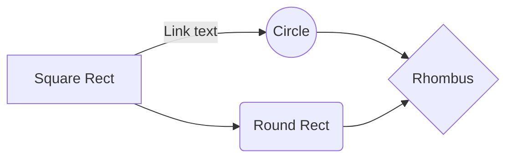

# 데이터 분석

## 나도 분석

 1. 일번
	 2. 다시 번호
 2. 이번
 3. 삼번
 - [ ] ㄴㄹㄴㅁㅇㄹㄴ
 - [ ] Listㄴㅇㄻㄴ item
Red Text
붉은 색
## 너도 분석

### 다시 분석
### 그래 분석

# 데이터 수집

## 우리도 수집
## 너희도 수집

### 그래 같이 수집
### 또한 수집

# 데이터 모델링

<!--stackedit_data:
eyJoaXN0b3J5IjpbLTk1Nzg0MzQ5NiwtMjA0ODk5MTQyMiw3Mz
A5OTgxMTZdfQ==
-->