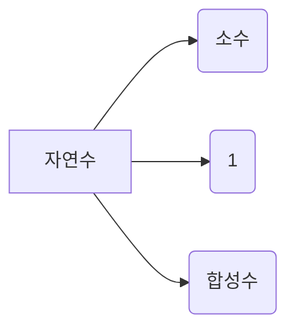
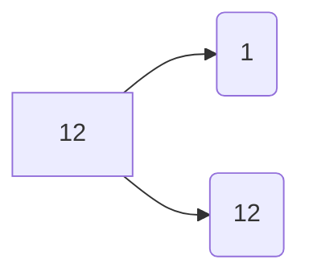
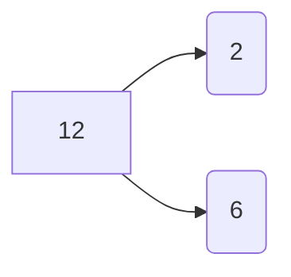
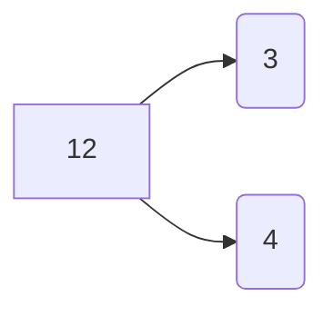
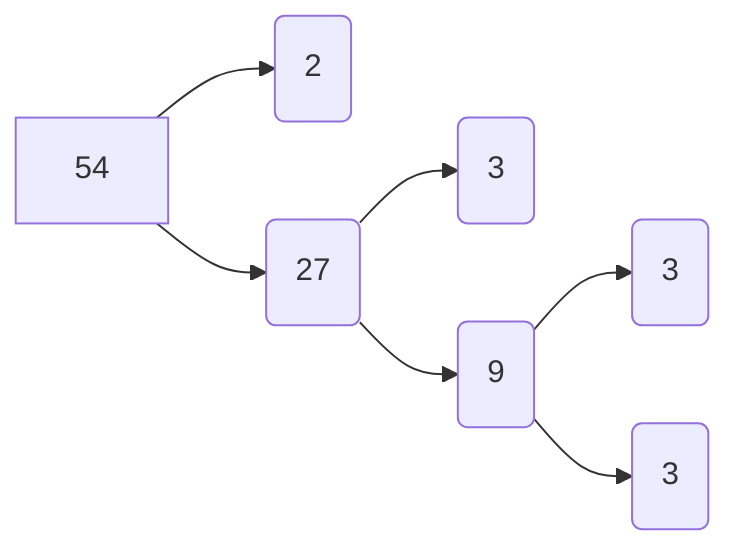
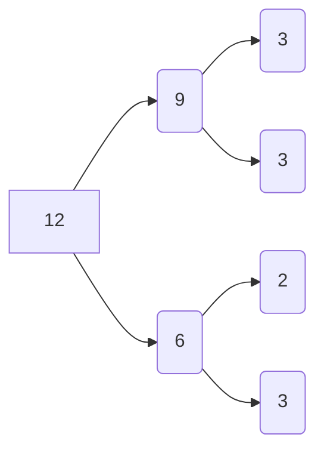

## 소인수분해

> 소수란?

 소수란, **1보다 큰** 자연수 중에서 1과 자기 **자신만을 약수**로 가지는 수이다.
따라서 소수는 **약수가 2개인 수** 이다.  *( 1, □ )

> 합성수란?

 합성수란, 1보다 큰 자연수 중에서 소수가 아닌 수이다.
즉, 합성수는 **약수가 3개**인 수이다.

*1은 소수도 아니고, 합성수도 아니다*

예)

(1) 13은 약수가 1과 13뿐이므로 (  소수  )  이다.
(2) 8은 약수가 1과 8 이외에 2와 4도 있으므로 (  합성수  )  이다.

    ' 에라토스테네스의 체'
소수를 구하는 방법

 1. 1부터 □ 까지의 수를 적는다.
 2. 소수는 1보다 큰 수이므로 수 1을 지운다.
 3. 남은 자연수 중 가장 작은 수 2를 남기고, 2의 배수를 모두 지운다.
 4. 남은 자연수 중 가장 작은 수 3을 남기고, 3의 배수는 모두 지운다.
 5. 이와 같은 방법으로 남은 수 중 가장 작은 수는 남기고, 그 수의 배수를 모두 지운다.
 6. 이 중에서 지워지지 않고 남은 수는 모두 소수이다.

## 거듭제곱

> 거듭제곱이란?

거듭제곱이란. 같은 수를 여러번 곱할 때 **곱하는 수**와 **곱한 횟수**를 이용하여 간단하게 나타낸 것

2×2=2²                 

2×2×2=2³

2×2×2×2=2⁴

 이때 2²은 2의 제곱, 2³은 2의 세제곱, 2⁴는 2의 네제곱 으로 읽고, 2²,2³,2⁴ 을 통틀어 2의 **거듭제곱**이라고 한다. *(단, 2¹은 2가 1번 곱해진 것이므로 1로 정한다.)*
 여기서 **곱하는 수** 2를 거듭제곱의 **밑**, 2를 **곱한 횟수**를 나타낸 수를 **거듭제곱**의 **지수**라고 한다.

예)

(1) 3⁴에서 밑은 ( 3 ), 지수는 ( 4 ) 이다.
(2) 3×3×5×5×5를 거듭제곱을 사용해서 나타내면 3²×5³ 이다.

> 소인수분해는 어떻게 할까?

6이 두 자연수 2와 3의 곱임을 나타낸 것이다. 이와 같이 자연수 12를 두 자연수의 곱으로 나타내려고 한다.

위에서 구한 12의 약수 1,2,3,4,6,12를 12의 **인수**라고도 한다. 특히 12의 인수 중 2와 3은 소수 이다. 이와 같이 어떤 자연수의 소수인 인수를 그 자연수의 **소인수**라고 한다.

*15의 인수는 1,3,5,15 이다. 이 중에서 15의 소인수는 3,5이다.*

1보다 큰 자연수를 그 수의 소인수만의 곱으로 나타내는 것을 **소인수분해** 한다고 한다.

28은 다음과 같이 여러 가지 방법으로 **소인수분해**할 수 있다.

이때 54는 어떤 방법으로 소인수분해 하여도 그 결과는 모두 2×3³ 이다. 어떤 자연수를 소인수분해 했을 때, 그 결과는 곱하는 순서를 생각하지 않으면 오직 한 가지뿐이다.

 1. 소수는 모두 홀수 일까?
 -아니다 자연수 2는 소수이지만 짝수이다
 
 2. 48은 2⁴×3 또는 3×4² 이니까 소인수분해하는 방법은 두가지 일까?
 -아니다, 인수4는 소수가 아니므로 3×4²는 소인수 분해한 것이 아니다.

 

<!--stackedit_data:
eyJoaXN0b3J5IjpbLTQ2MDk4MTMwLDIwNDAyOTc2MjJdfQ==
-->